# 第01章 - 脑电信号
脑电信号是通过电极记录下来的脑细胞群的自发性、节律性电活动。我们通常所说的脑电图是指头皮脑电图(scalp electroencephalogram),实际上就是头皮电位差与时间之间的关系图。脑电波是脑神经细胞总体活动,包括离子交换、新陈代谢等的综合外在表现,深人地研究脑电波的特性将推进人们对自身大脑的探索研究进程,增强其对疾病的辅助诊断能力。

## 1-1. 脑电研究历史
Berger 首次记录到了人类的脑电活动并第一次将脑电活动命名为electroencephalogram(EEG)。由于他在脑电研究上的卓越贡献, Berger被后人称为“人类脑电图之父”。虽然Berger的成果是如此令人兴奋，但当时却不被大多数的生理学家和神经病学家所承认。其原因之一就是因为**当时的生理学家着重于研究末梢神经纤维的电活动**，而**研究中枢神经系统电活动的学者较少**。此外,当时对于脑电特性认识的不统一也是一个主要原因。直到1933年英国的著名生理学家(1934年的诺贝尔奖获得者)EDAdrian男爵在当时设备最完善的剑桥大学生理学研究室同BMathews一起研究了脑电图肯定了 Berger 的有关研究。之后，脑电的研究才得以快速发展,并被推广到全世界范围。1958 年,英国伦敦大学的美国学者Dawson 研制出了一种用于平均瞬时脑诱发电位的电-机械处理装置,开创了脑诱发电位记录共术的新纪元,他因此被后人称为临床脑逐发电位(evoked potential, EP)的创始人。**脑诱发电位是对被试(subject)施以某种有规律的外界刺激(声光、图像、味和触觉等)时,在人脑相应的部位诱发出的一种电信号,它的发现为脑电研究另辟蹊径，被称为“窥视精神之窗”。**

<u>脑电作为一种无创的检测手段，其研究涉及神经生理学、心理学、病理生理学认知神经科学、神经工程乃至社会心理学、信息与信号处理等诸多领域</u>。 但是由于脑电发现早期的技术限制，当时的脑电研究都是进行目视分析，这种简单的定性分析很难在复杂多变的脑电波中直接发现具有意义的信息。直到 20 世纪六七十年代,随着计算机技术的迅猛发展,脑电的分析才进入了计算机分析的阶段。使得脑电波的定量分析有据可依,定性工作有了定量的支持而更具有客观性

从脑电发现的那一刻起,它的研究就和应用紧密地结合在一起。**1936 年英国的w.G.Walter 根据脑瘤时慢波的出现部位.提出了脑瘤的脑电图定位方法,将脑电研究引人了临床诊断工作。脑电在临床上主要应用于癫病、脑外伤、脑血管疾病、颅内炎症、睡眠障碍等神经科疾病,以及部分精神疾病包括精神分裂症、神经症和老年性精神病等的辅助诊断中。**现在，脑电图检查室已经被广泛地建立在综合医院或神经、精神科医院。脑电的研究和临床应用都有了长足的发展。尤其是伴随着电子计算机技术的高速发展,脑电的研究及应用也有了质的飞跃. 脑电不仅在研究和疾病诊断方面，而且**在功能康复等方面也起到了一定的作用**。利用脑电信号(脑电波)进行脑功能训练的技术起源于 20世纪70年代，在90年代形成第二个高峰，它成为一种生物反馈(biofeedback)治疗技术的主要途径.

近年来，**脑-机接口(brain computer interface,BCI)的研究也呈现上升趋势, BCI技术在康复工程、军事等领域有重要的应用价值, 已引起了全世界越来越多科学家和研究者的关注和重视。** BCI技术是在人脑与计算机或其他电子设备之间建立的直接的交流和控制通道,它不依赖于脑的正常输出通路(外周神经系统及肌肉组织), 是一种全新的对外信息交流和控制方式。而该系统的最核心部分就是对于脑电信号的分析过程---特征提取部分。**能否快速有效地提取出与作业任务相关的特征是当前摆在研究人员面前的最大的课题**。

## 1.2 脑电的生理学基础
### (1) 脑的解剖和功能
大脑皮质（英语：cerebral cortex），又称为大脑灰质，或简称为**皮质或皮层**，是大脑的一个解剖结构，由神经灰质组成。大脑皮层是大脑（端脑）的一部分，属于脑和整个神经系统演化史上最为晚出现、功能上最为高阶的一部分。
### (2) 大脑皮层分区
参考链接：https://zhuanlan.zhihu.com/p/444420583
#### (2)-i 依据空间位置的大脑皮层分区
根据空间位置，大脑皮层被分为几个脑叶。每个叶是空间上连通的一部分皮层。以下列出的是这些分区的名称及目前学术界所认为的主要功能：
*   额叶(frontal lobe)：**高级认知功能**，比如**学习、语言、决策、抽象思维、情绪**等，**自主运动的控制**（参见运动皮层）。
*   顶叶(parietal lobe)：**躯体感觉**（参见体感皮层），**空间信息处理，视觉信息和体感信息的整合**。
*   颞叶(temporal lobe)：**听觉**（参见听觉皮层），**嗅觉，高级视觉功能**（例如物体识别），分辨左右，长期记忆。
*   枕叶(occipital lobe)：**视觉处理**（参见视觉皮层）。
*   边缘系统：奖励学习和情感处理。
> **图2.a 大脑皮层分区**
> 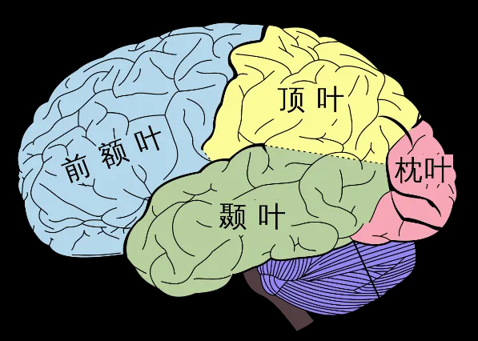
> **图2.b 大脑皮层沟回位点介绍**
> 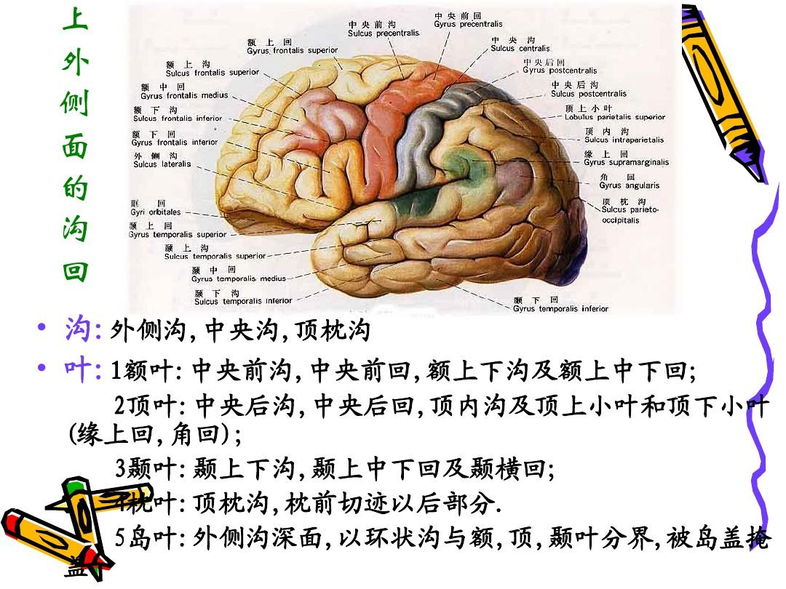
> 额叶：由额际起至中央沟和外侧裂以前的部分。包括中央前沟、额上沟、眶沟眶回、嗅沟、扣带回和旁中央小叶。
> 顶叶：前缘为中央沟,后缘连接顶枕裂，下缘抵外侧裂平面,其中有中央后沟,在中央沟之后,且与之平行分为上下两部。顶叶又包括顶间沟、缘上回、角回、中央后回和楔前叶。
> 枕叶：为位于顶枕裂连接前切迹间假设线之后的锥状形脑叶。
> 颞叶：颞叶在外侧裂的下方, 顶叶的前下方, 枕叶的前方; 又根据颞上、中、下沟界分为颞上、中、下三回。
> **图2.c 沟、回、裂**(https://www.sohu.com/a/316376161_130047)
> 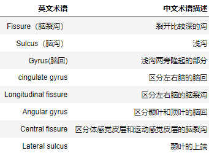
> 沟是大脑皮层凹陷的部分, 回是大脑皮层中略凸起, 裂是指很深的沟, 例如大脑纵裂
> 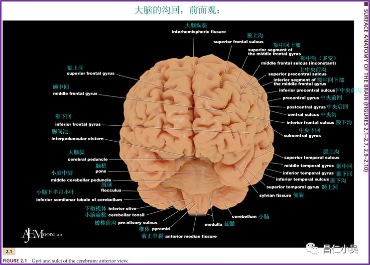
> 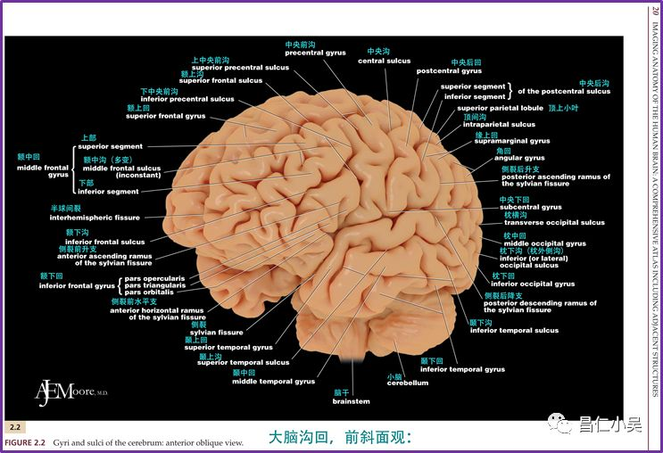
> 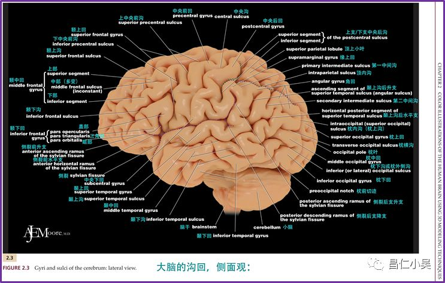
> 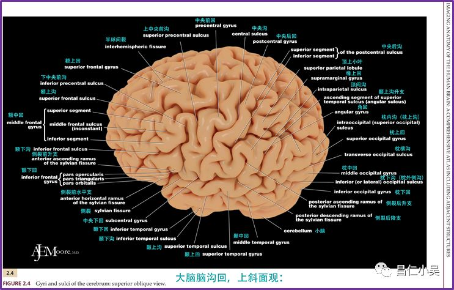
> 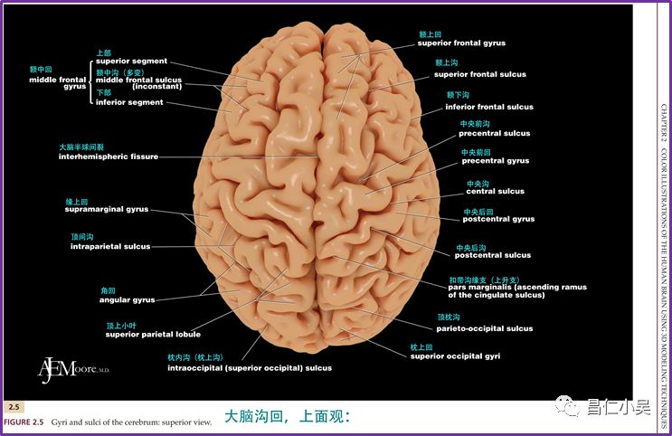
> 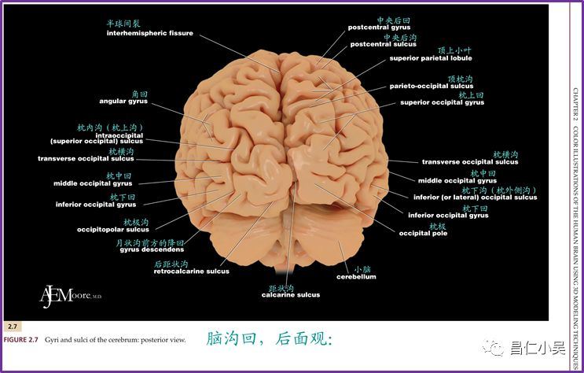
> 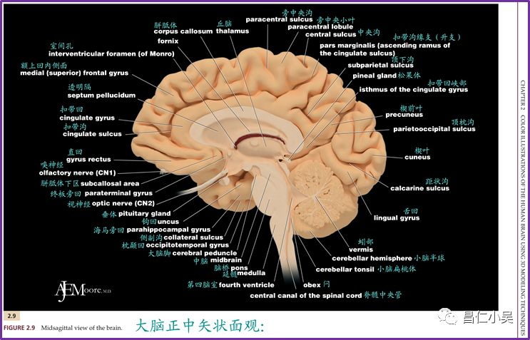

#### (2)-ii 运动皮层介绍
运动皮层（英文：Motor cortex），是大脑皮层中负责掌控自主运动的区域。运动皮层位于额叶上的中央前回后部，在中央沟的正前方。**运动皮层可分为三个主要区域**：

*   **初级运动皮层（Primary motor cortex）**。该部分是最主要的产生运动性神经冲动的区域，该信号可通过脊髓传递至肌肉。但脑部其它一些区域也参与行使此项职能，譬如中央旁小叶的前部。
*   **前运动区（Premotor cortex）**。该部分位于初级运动皮层前方，负责控制运动的某些方面，包括运动的准备、运动中的感觉导向、空间导向以及身体的近端和躯干肌肉所参与的部分运动。
*   **运动辅助区（SMA）**。该部分位于初级运动皮层前方，研究认为其负责对运动的内在规划、对动作次序前后的组织以及身体两侧的协调等。
> 运动皮层划分
> 初级运动皮层（Primary motor cortex）、前运动区（Premotor cortex）、运动辅助区（SMA）
> 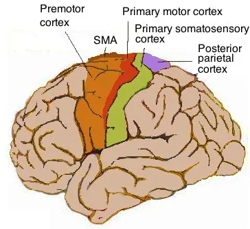
* **初级运动皮层**
初级运动皮层（英文：Primary motor cortex），是人类大脑皮层中运动皮层的**最主要部分**，**位于中央前回**。初级运动皮层是运动系统最主要的部分，与其它脑部运动区域相互配合控制人体运动，**包括前运动区、运动辅助区、后顶叶皮层等等**。初级运动皮层在解剖学上**位于布罗德曼分区系统4区**，包含大型神经元—贝兹细胞。贝兹细胞与其它皮层细胞的长轴突延伸至脊髓内，通过突触与其中的中间神经元网络相连，或者直接与alpha型运动神经元相连（后者另一端连接着肌肉）。
在初级运动皮层中，运动控制区域反向有序排列，**控制脚趾的区域位于大脑半球的顶端**，而**控制嘴部的区域则位于中央沟附近**。但身体一些部分也由某些皮层交叉区域控制。初级运动皮层中，**一侧的大脑半球控制身体另一侧（contralateral side）的运动**。
此外，体表某个部分面积越大，**并不代表其在大脑皮层中的运动控制中心越发达**，但如果某处皮肤运动感受器的相对密度越大，则运动中心越发达。一般而言，皮肤运动感受器的密度代表了此处躯体运动所需的精确度，因此人手和脸部的皮层控制区域要大于腿部。
* **前运动区**
前运动区，或称前运动皮质（英语：Premotor cortex），是大脑额叶与运动相关的一个功能分区。在解剖位置上，它与后方的初级运动皮质相邻，在前方与前额叶的Brodmann 8区8区，9区和44相邻。从细胞结构分区上来说，**前运动皮质基本属于Brodmann 6区的两个主要组成部分之一**。另外一个组成部分是运动辅助区（Supplementary motor area）。前运动区位于大脑额叶的外侧面，而运动辅助区位于大脑额叶的内侧面。
* **运动辅助区**
运动辅助区（英文：Supplementary Motor Area, SMA 或 Supplementary motor cortex, SMC）是大脑皮质的一个主要与运动功能相关的区域。在解剖位置上来说，SMA位于大脑半球的内侧面，和初级运动皮层的前方。从细胞结构分区上来说，**SMA位于Brodmann 6区**。但是Brodmann 6区除了包含SMA，还包含位于脑半球外侧面的前运动区。在进化历史上，该区域出现较晚。
**运动辅助区（SMA）的功能与运动的计划有关**。与前运动皮层不同，SMA主要参与动物体自身产生和控制的运动，而不是在外界刺激下所产生的运动。例如SMA参与从记忆中产生的序列运动。
**前运动辅助区（Pre-SMA）的功能与学习新运动序列有关**。该区域中的神经活动在动物执行较新的运动序列时较高，而在该运动序列被学习完后，前运动辅助区中的神经活动降低。**运动辅助区本部（SMA Proper）与前运动辅助区不同，它在执行学习好的运动序列时激活**。有些SMA本部中的神经元在执行特定的动作序列时发放冲动，其他一些SMA本部中的神经元在准备特定位次的动作时发放冲动。比如，有些神经元在动物准备执行某个序列的第三个动作时激活，而与这个动作具体为何无关。
> 运动皮层（右脑）控制不同的肌肉群
> 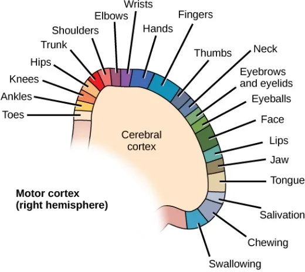
> 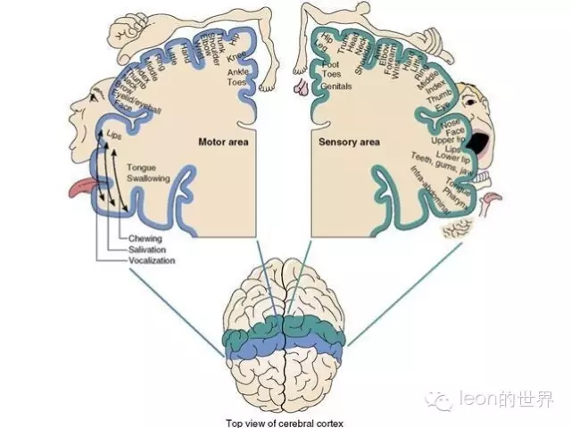

### (3) 脑电波的形成
人体中枢神经系统的神经元动作电位(action potential)主要是藉由与钠、钾、钙等离子相关的离子通道的开闭来传递电讯号,这些离子通道的开闭使得神经元本身在传递电信号的短暂过程中形成一处微小电场。人脑电波是如何形成的?脑电基本波即a波的频率是 10Hz 左右，这些周期为100ms 以上的波与神经细胞体或神经纤维的动作电位，即持续时间为1~2ms 的峰形波(spike)相比较是非常慢的波。
#### (3)-i 脑电节律活动
产生脑电节律活动的条件 脑中电场必须相当强，才能在头皮表面记录出电位变化，而欲使脑中电场达到相当强度，必须具备两个条件：
**（1）同步化。** 大脑皮层是由100余亿神经元所组成，从皮层表面记录出的电位是许多神经元活动时所产生的电场的总和。故节律性的脑电波是许多神经元同时活动和同时抑制的结果。这种同时放电或同时抑制的过程就是“同步化”。如果由于某种原因而使神经元不能同时放电或同时抑制，就是“去同步化”。所说同步化，包括频率与位相皆相同。否则，如两个神经元发放的频率相同而位相相反，就仍然不会出现大的波幅。通常，同步化的程度越大，则波幅越大而频率越低；反之，去同步化的程度越大，则波幅越小而频率越高。
**（2）神经元的排列方向一致。** 大脑皮层的**锥体细胞**排列非常整齐，其顶树突都伸向皮层表面，因此，脑电波的形成极有可能是由于许多锥体细胞产生的电位自细胞体传向皮层表面的结果。
#### (3)-ii 大脑皮层神经元突触后电位组成学说
脑电活动的皮层神经元机制 由于最常见的脑电波节律为每秒10次左右的α节律，每个波的周期约为100毫米，这要比神经元的动作电位慢得多，而和**神经元的突触后电位**的时程较近似，因而提出脑电波是由神经元的同步性慢活动所引起的。此外，动物实验表明，将微电极插入猫的皮层神经元内，发现微电极所记录的皮层神经元的慢的突触后电位常与粗电极在皮层表面记录到的同步化脑电波时程相同，尤其在每秒8～12次的梭形波时更为明显。此外，静脉注射快速作用的巴比妥药物时，脑电波与细胞内记录的突触后电位同时消失，而当药物作用过后，两者又同时恢复。因此可认为：脑电波是由皮层细胞群同步活动时突触后电位（包括兴奋性突触后电位与抑制性突触后电位）的总和所形成的。

皮层神经元节律性同步活动的起源 动物实验表明，当切断皮层与丘脑的联系后，皮层的α节律消失，而丘脑中类似α波的节律性活动依然存在。损毁丘脑后，皮层也不再出现自发的节律性活动。因此可以认为，皮层的自发的节律性活动来源于丘脑，然后从丘脑传递到大脑皮层。综上所述，一般认为，**脑电图波形是大脑皮层神经元突触后电位总和而形成，而其节律性活动的产生与丘脑有关**。

> 在动物实验中观察到，应用微电极所记录的皮层神经元的慢突触后电位与皮层表面记录到的脑电波的电位变化相似,尤其在a波出现时。但单个神经元的微弱的突触后电位显然不足以引起皮层表面的电位改变，因此认为，脑电波是由大量神经元同步发生的突触后电位经总和后形成的,而突触后电位总和的结构基础是锥体细胞在皮层排列整齐，其顶树突相互平行，并垂直于皮层表面，因此其同步活动较易发生总和而形成强大的电场，从而改变皮层表面电位。进-步研究表明,大量皮层神经元的同步电活动与丘脑的功能活动有关。在中等深度麻醉的动物，在皮层广泛区域可记录到8~12Hz的类似a波的自发脑电活动;在切断丘脑与皮层的纤维联系或切除丘脑后，皮层的这种类似a波的节律便大大减弱或消失;但切除皮层或切断丘脑与皮层的纤维联系后，丘脑髓板内核群的类似a波的节律仍然存在;以8 ~ 12Hz的频率电刺激丘脑非特异投射核，可在皮层引导出类似a波的电变化。记录丘脑髓板内核群神经元的细胞内电活动时,可观察到重复刺激可出现EPSP和IPSP的交替,在皮层也可见到同样节律的电位周期性变化,因而推测皮层电话动的同步化是由于丘脑非特异投射核的同步化EPSP和IPSP交替出现的结果。以高频电刺激丘脑髓板内核群，可使皮层中类似a波的节律变为去同步化快波.这可能就是a波阻断的产生机制。----节选自《生理学》第九版

#### (3)-iii 神经元结构与信息传递的方式
神经系统、脑、脊髓、周围神经和神经节的结构由神经组织构成。在细胞水平上，这种组织包含神经元和神经胶质。神经元是信息载体。它们传递感觉信号和运动命令。神经胶质细胞支撑神经元以及支持与环绕神经组织的其他结构。星形胶质细胞是脑中最常见的神经胶质细胞，其围绕着毛细血管，维持着血流和神经元之间的屏障，并主动控制通过该屏障的物质。其他神经胶质细胞还包括小胶质细胞、室管膜细胞和少突胶质细胞，可维持神经元稳态、清除病原体、循环脑脊液、保护神经元并影响其信号传导速度。
> 图1. 神经细胞结构图
> 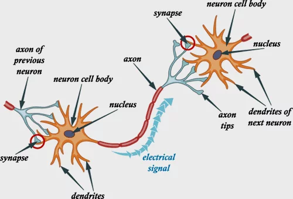
> 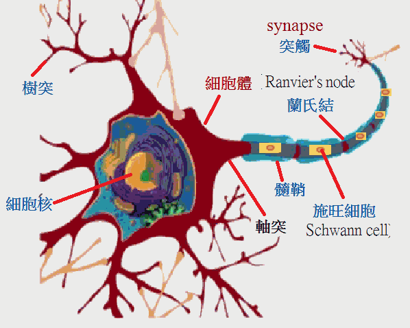
> 图2. 神经元和神经胶质
> 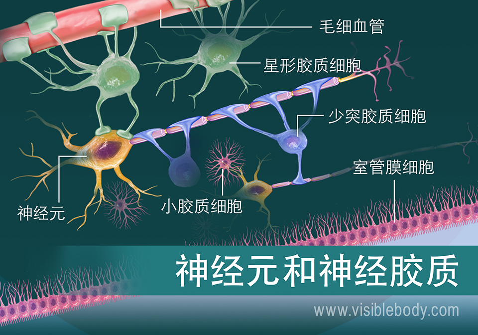

人类的脑神经细胞数量约有一千五百亿个，这些细长树枝状的脑细胞(树突dendrite）彼此之间，又会形成上兆个称为突触(synapse)的连结。突触的重要性，在于它们串联起神经传导的路径，与其它脑细胞结合并相互联络，促使联络网的发达，于是开启了信息电路。

在脊椎动物中，许多神经元的轴突被髓鞘包裹。髓鞘的成分是许旺细胞（Schwann cell)。目前知道髓鞘的功能有三。一是提供轴突与周围组织，例如相邻的轴突之间的电力绝缘，以避免干扰。二是通过一种称为「跳跃式传导」的机制来加快动作电位的传递。三是在一些轴突受损的情况下引导轴突的再生。一个轴突的髓鞘是由许多沿轴突排列的许旺细胞构成的，相邻的许旺细胞之间的轴突细胞膜没有髓鞘，这些裸露的部分叫做兰氏结（Ranvier's node）。

轴突(axon)作为神经细胞的输出通道，可以与一个或多个目标神经元发生连接(下图5对1连结)。一些轴突在运行中发出分支，这些分支称为侧支（Collateral）。来自主枝的动作电位在各个侧支上同时继续传递，最终达到不同的目标。在轴突与目标神经元发生联系的部位，一种称为「突触」的结构实现两个（或有时为多个）神经元之间的通信。

### (4) 脑信号分类
这里是按频率分类
* $\delta$ 波: 频率范围为0.5-4Hz，高振幅波，通常会在成人进行深度睡眠时出现。该频段出现的部位通常是在成年人的前额位置和婴儿的后脑位置
* $\theta$ 波: 频率范围为4-8Hz，被发现在婴儿的脑中更容易出现，以及在成人和青少年出现睡意（或睡眠初期）的时侯出现；也会在人的大脑处于空闲状态或冥想时出现
* $\alpha$ 波: 频率范围为8-13Hz，它是节律性脑电波中最明显的波，通常出现在头的后部，在头两侧都会有，主导侧的振幅会比较高。当清醒的人处于放松或者闭眼状态时，可以在枕叶区探测的EEG中检测到alpha波。在BCI应用中，一种特殊的 alpha波称为mu节律（8~12Hz)。当受试者不运动时，mu节律会出现于感觉运动区域，当受试者进行运动或者想象进行运动时，mu节律会减小或者消失。（控制抑制）
* $\beta$ 波: 频率范围为13-30Hz，低振幅波，通常会对称地出现在大脑两侧，且在大脑的前部最为明显，可以在顶叶和额叶检测到。出现这频段的脑波时，人们往往处于注意力集中，逻辑思维活跃，情绪波动，警觉或焦虑的状态
* $\gamma$ 波：频率范围为30-50Hz。通常会出现在体感皮层，出现该频段时人通常处于十分激动、亢奋的状态，或是受到了强烈的刺激。它也会在人跨模态感知处理中出现，例如进行物体识别，声音或触觉的短期记忆等。

## 1-3 脑电信号的采集
选择合适的被试对研究结果的普遍性和可靠性都具有重要的影响。一般地，正常被试的选取要注意被试的性别,年龄、社会背景和受教育情况等因素。此外,还要注意被试的利手问题尤其是在需要被试进行按键或其他手部动作的作业任务中。

脑电信号由于电位很低，只有不到$100\mu v$, 很容易受到包括工频在内的周围电磁场辐射的干扰和检测仪器内部电子噪声的干扰。虽然目前由于仪器设备的性能,整个实验可以不在电磁屏蔽室内进行, 但仪器也应尽可能接地, 并远离强大的静电场与电磁场。同时要尽量保证测试环境的安静,以免在实验进行时有不必要的杂波混入。

电极的位置通常按照**国际标准导联10-20系统(10-20electrode system)安放**该国际标准的基本原则如下:
* 电极位置应根据颅骨标志的测量加以确定;
* 尽可能与头颅的大小和形状成比例;
* 电极的标准位置应适当分布在头颅的所有部位;
* 电极位置的名称应结合脑部分区(额、题顶枕);
* 应进行解剖学研究，确定标准电极下是哪个皮层;
* 用国际阿拉伯数字标示电极: 左半球为奇数, 右半球为偶数. 零点代表头颅正中位, A1、A2代表左右耳垂。接近中线的用较小的数字,较外侧的用较大的数字。

依照以上原则,国际脑电图学会制定了标准电极安装法。所谓 10-20 系统是指在矢状位上将鼻根(nasion)和枕外粗隆(inion)相连接在冠状位把鼻根外耳孔和枕外粗隆相连,中点为头顶(vertex)即Cz。通过Cz将两个连线各分为2个10%和 4个 20%。这样选取电极位置,使得每个电极与邻近电极离开 10%或20%的距离
> 10-20国际标准导联系统 
> https://www.cnblogs.com/RoseVorchid/p/11929551.html
> https://blog.csdn.net/zengleilee/article/details/120028085
> 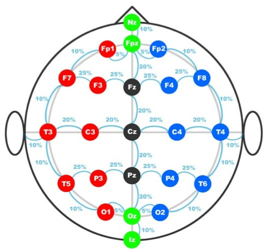
> 字母代表的含义：
> F: 额叶(Frontal lobe)
> Fp:前额叶（Frontal poles）
> T: 颞叶（Temporal lobes）
> O: 枕叶（Occipital lobes）
> P: 顶叶（Parietal lobes）
> C: 中心部（Central） 或感觉运动皮层（sensorimotorcortex）
> Z: 零点（zero）即左右脑中心
> 示例
> 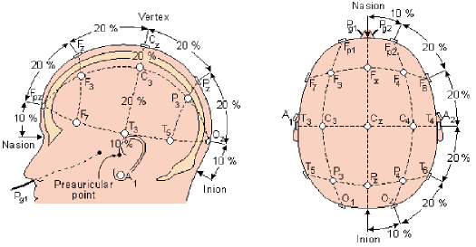
> 如上图，将从鼻根至枕外粗隆的前后连线称为矢状线，将双耳前凹之间的左右连线称为冠状线。两条线的焦点在头顶为Cz电极的位置。
> 矢状线由前到后依次为Fpz、Fz、Cz、Pz和Oz，除Fpz与鼻根，Oz与枕外粗隆的距离为矢状线长度的10%外，其余点间距为矢状线长度的 20%；沿着冠状线，从左耳前凹10%处，依次为T3、C3、Cz、C4、T4，各点之间的距离均为冠状线长度的 20%。其他各点的位置如上图所示。其中，用阿拉伯数字表示电极，左半脑为奇数，右半脑为偶数，A1、A2 分别代表左右耳垂，外侧到中线数字逐渐减小。

### EEG信号的采集与量化
采用专用的电极(帽)从头皮可以采集到微弱的脑电信号。EEG 的电极实际上是一种电压传感器,通过它来记录头皮上的电位变化。电极通常用银或合金等制成,而以银电极上镀氯的氯化银(Ag-AgCI)电极为最好。由于自发脑电信号十分微弱,获取后必须通过放大器、滤波器和模/数(A/D)转换后才能转换为计算机识别的脑电信号。因此在脑电采集中脑电信号的放大是至关重要的一个环节。**EEG信号的带宽是0.5~100Hz, 其幅度范围通常是 10~100uV, 这对放大器的要求是非常高的**。因此一台脑电图仪的性能优劣很大程度上取决于该系统的放大器的性能。经过放大的信号还必须经过滤波器的处理，**滤波的目的在于对该信号作数字处理前尽可能降低噪声背景对信号的污染，改善信噪比，保留原始信号的真实性**。除了放大和滤波外，**信号预处理还需要防止 A/D变换后产生频率混叠，消除基线漂移及趋势项，滤除非研究电生理信号产生的伪迹(artifact 或artefact,也称为伪差)**,改善信噪比等

> # *TODO*
> 神经细胞电信号的详细过程
