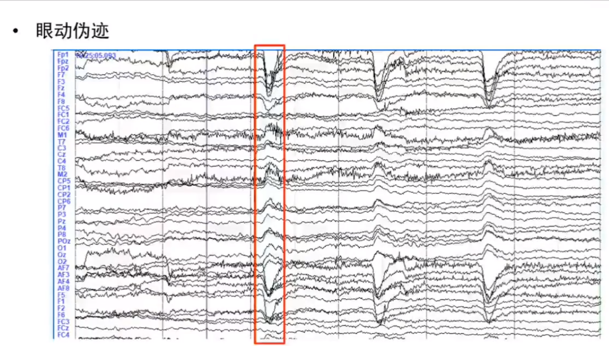
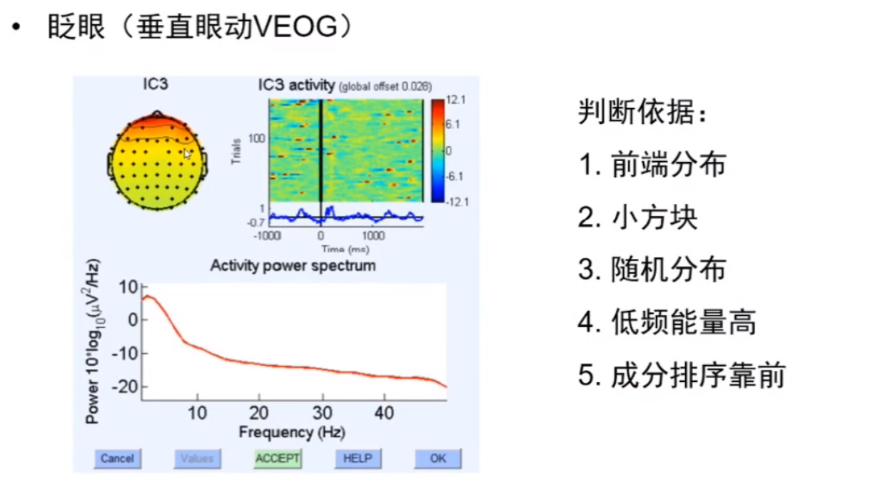
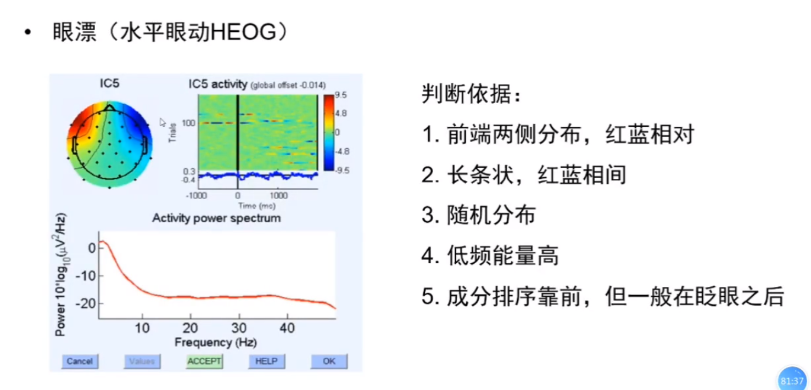

## 单被试EEG预处理步骤
* Import data-- 导入数据
* Channellocation -- 导入电极信息
* Select data -- 删除无用电极
* bad channel interpolation -- 插值坏导
* Re-reference -- 重参考
* Filter-- 滤波
* Resample -- 重采样
* Extract epoch and Remove baseline -- 分段和基线校正
* Inpendent component analysis (ICA) -- 独立成分分析(去眼电)
* Artifact rejection (bad epoch)-- 剔除坏段
## EEGLab基本操作教程
1. 图文教程
   [eeglab中文教程系列 汇总](https://blog.csdn.net/zyb228/article/details/103015904)
2. 视频教程
   [脑电数据预处理：基于EEGLAB](https://www.bilibili.com/video/BV1M5411W72B?p=3)

上面两个教程都十分优质，图文教程清楚明了，视频教程是一个小姐姐讲的，声音很好听(误)，完整展示了数据预处理的操作细节，时长90分钟。建议先观看视频再去看图文，会有一种更轻松的感觉（~并不~）。整体观摩下来，有一种知其然但不知所以然的感觉，要这么做，但为什么这么做？为什么这样做就可以达到目的？为什么要有这个目的？这样做有哪些副作用？这样做以后得到什么结果？下一步要做什么？总结：还得看书，还得去看数学原理。

## 一些细节
这里就不放详细的处理步骤还有内容了，实在是太多了，而且上面的教程也很清楚，这里脂肪一些心得和一些特别提到的点。
### 1. 关于数据导入与波形绘制
导入数据后，点击plot的下的channel data(scroll)选项就可以绘制脑电波形图，但看上去似乎与通常看到的不太一样？此时需要点击Display->Remove DC offeset，也即去除直流漂移，再把scale调整到50左右即可。

### 2. 关于重参考基准选取的几点考虑
记录EEG数据使用的参考电极通常被称为数据的"通用"参考(common reference)。EEG记录中的典型记录参考是一种乳突(如下图10-20系统中的TP10,下图中红色的电极)，相连的乳突(通常是数字相连的乳突，computed post hoc，顶点电极(Cz ),单个或相连的耳垂或鼻尖，带有活性电极的系统(例如BioSemi活性二级)可以记录无参考的数据。在这种情况下，在数据导入过程中选择时候引用参考，否则会在数据中留下40 dB的不必要噪音。[注：没有"最佳"公共参考站点，一些研究人员声称，非头皮参考（耳垂，鼻子）比头皮通道参考引入的噪声更大，不过据我们所知尚未证实]。一些研究人员主张在分析之前将数据从固定或(common reference)通用参考(例如, 从通用耳垂或其他通道参考) 转换为"平均参考(average reference)"，尤其是当电极拼接几乎覆盖整个头部时(对于某些高密度记录系统)。平均参考点的优势在于，在整个(电隔离)球体上,向外的正电流和负电流之和为0 (根据欧姆定律)。例如，在下图中，切线方向的电源与左侧的正向内向正电流（此处为蓝色）和右侧的反向外向负电流（红色）相关联。如果通过颅骨底部到颈部和身体的电流微不足道（例如，由于颅底在大脑底部的电导率很低）,则可以假定所有头皮电极记录的电场值之和在所有（足够密集且均匀分布）始终为0（平均参考假设）.不过这种假设存在问题，其问题在于，真正的平均参考数据需要电极分布均匀。而实际上通常并非如此，因为研究人员通常会在某些头皮区域放置更多的电极，而在头表面下半部放置更少的电极（如果有的话）。因此，使用一个拼接的平均参考结果不能直接与使用另一拼接获得的平均参考结果相比较。下面，详细介绍了将数据转换为"平均参考(average reference)“的过程。注意，在此过程中, 前一个参比电极处的隐式活动时间过程可以从其余数据中计算出来(因此, 数据获得了一个附加通道-尽管不是一个附加的自由度!).另请注意，如果使用鼻尖或耳垂电极记录数据，则在计算(1)中的平均参考值时，不应包括这些参考电极(如下图)，因此，在下面示例中，除法因子{在(3)中}将是64而不是65。请注意，在使用EEGLAB dipfit插件本地化源代码时，将在内部使用"平均参考”（无需用户输入）。数据参考的选择会给数据分析的绘制结果着色（字面上）。例如，即使实际上有alpha源正好位于参考通道下方并朝向参考通道，头皮上的平均alpha功率图必须在参考通道处具有最小值！然后，没有(有效的)引用可以说是错误的-相反，可以说每个引用都提供了另一种数据视图。但是，在评估（或特别是比较）EEG结果时，必须考虑参考的性质。

### 3. 关于眼电伪迹的简单识别
分垂直眼动和水平眼动，一个是从波形图上看

红色方框展示的就是垂直眼动伪迹，而左侧的一个类似高原的波形就是水平眼动伪迹
另一个是从ICA成分分析得到的通道图例中看
垂直眼动:

水平眼动:

可以说虽然没拌饭完全说明这些热力图到底有个说明含义，花花绿绿的都是些啥，但仅仅从判断方法上看，似乎还算直观。

## 相关文章
[EEGLAB预处理2ICA分析](../eeglab预处理2ica分析/)

[EEG脑电数据预处理-原理篇(简书)](https://www.jianshu.com/p/791c3651e9ad)