## 独立成分分析的原理
独立成分分析 (Independent Component Analysis)**又称盲源分离(Blind Source Separation，BSS) 算法**, 它的工作就是要将混合的信号分离得到原始信号源的信号。如下图:

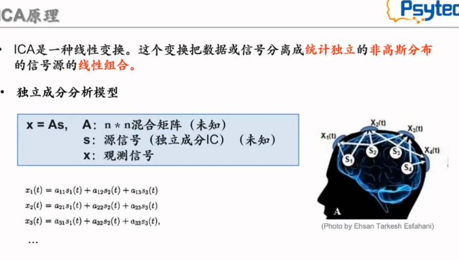

如图所示, ICA是一种线性变换, 它假设各个信号源发出信号是相互独立的, 并且监听通道数不少于信号源的数目, 同时他还假设信源发出的信号是非高斯分布的, 而对于时刻t某一通道k监听到的信号值$X_k^t$是各信源信号的线性组合。

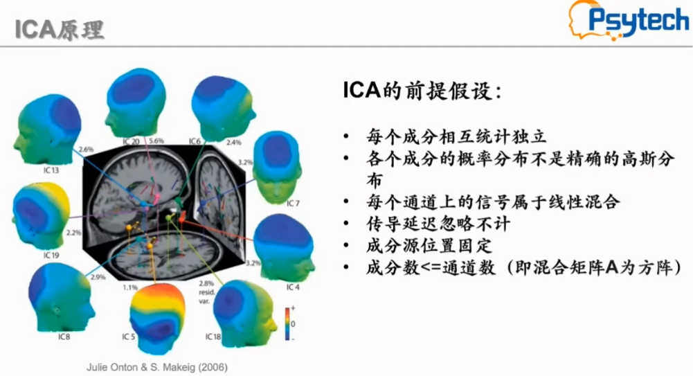

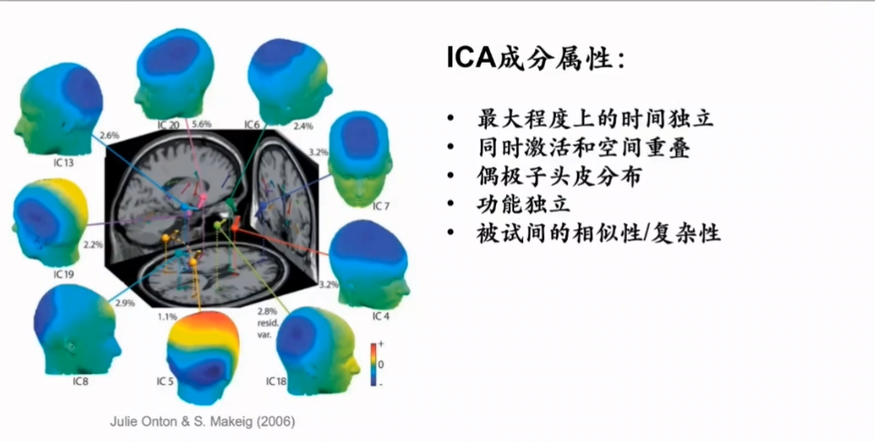

由此得到一个矩阵形式, 此时我们只知道观测值x, 而混合矩阵A和源信号均未知, ICA则是仅根据已知的观测值来求解混合矩阵的逆矩阵W(因而被称为盲源分离), 就有:

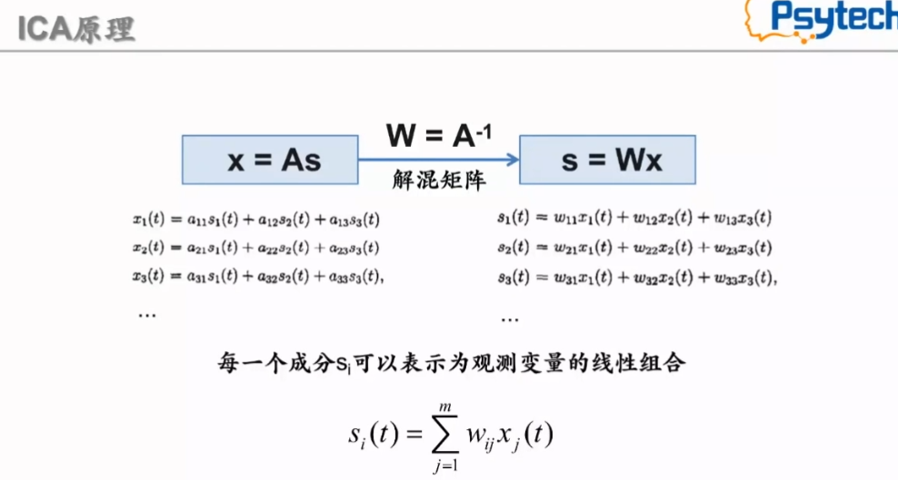

每一个成分$S_i$可以表示为观测变量的线性组合, 通过解混后就得到了各个独立成分, 对这些成分进行判别分析, 识别出是伪迹的成分, 将他们去除

所谓去除, 就是对于是伪迹的独立成分, 将他们置为0, 随后再用解混矩阵的逆矩阵将去伪迹后的独立成分还原为侦听数据

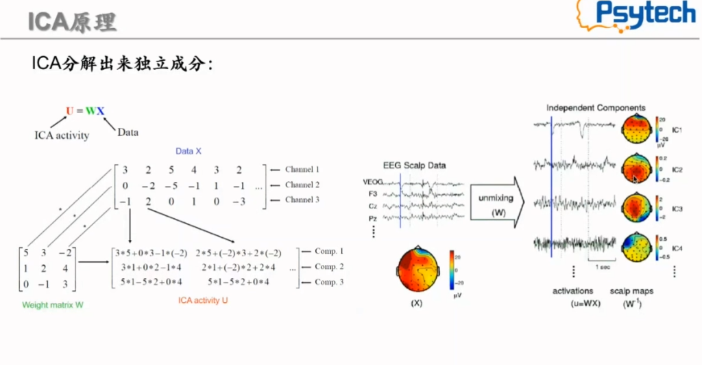

> 对于具体这一矩阵求解的数学原理以及代码实现和数据模拟, 之后写一篇详细探讨。可以参考 Onton, J, & Makeig, S. (2006). lnformation-based modeling of event-related brain dynamics. Progressin brain research,159, 99-120.这篇文章。

### 实际EEGLab的ICA分析
另外，在实际执行ICA前, 如前一节所讲, 还要做一些处理, 例如滤波、直流偏移校正、坏导去除等等以得到好的ICA结果

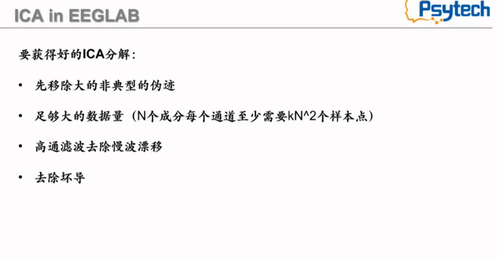

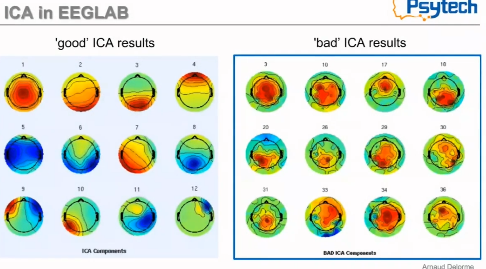

## 典型成分识别
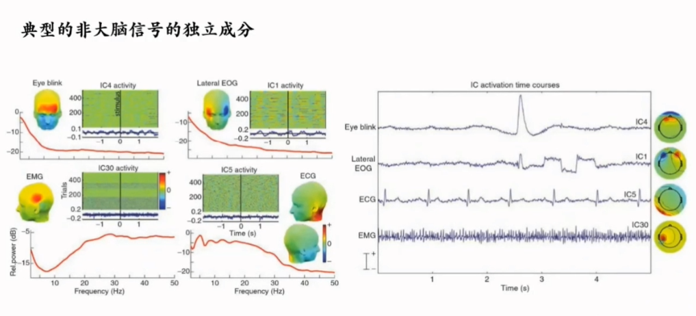

典型的伪迹包含垂直眼电、水平眼飘、心电、肌电等，上图给出了一个概括, 判别根据包括功率谱图、波形特征等。
* **肌电(EMG)**
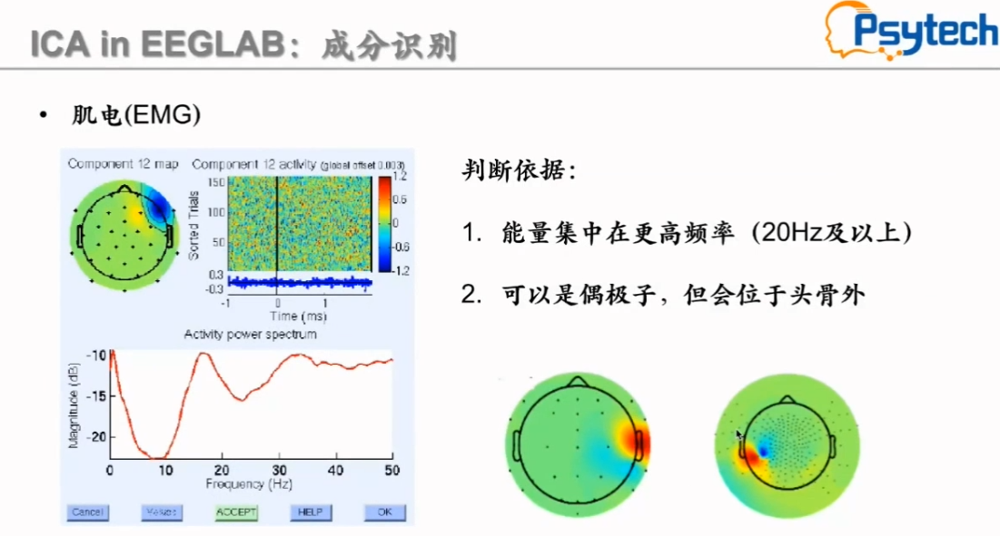

* **心电(ECG)**
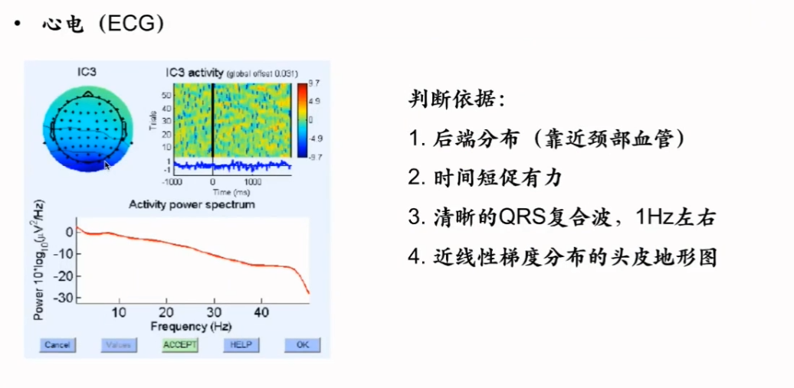

### 识别练习
https://labeling.ucsd.edu/labelfeedback
以上有一个识别练习网站
1. 坏导
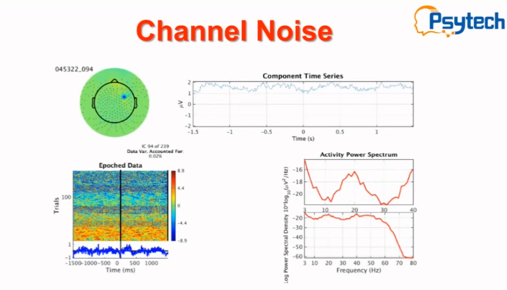

2. 未知的非典型的伪迹
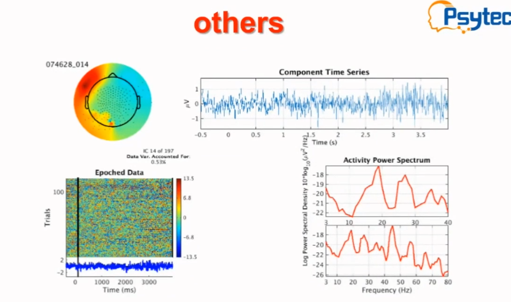

3. 心电
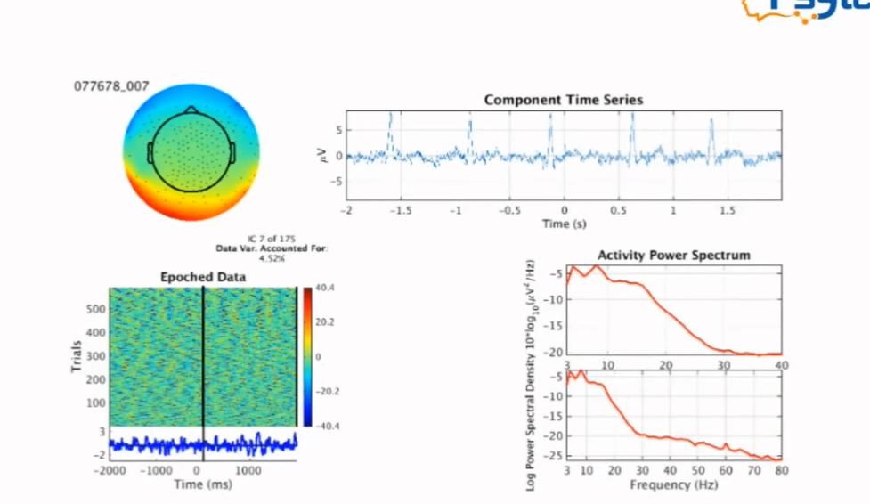

4. 肌电
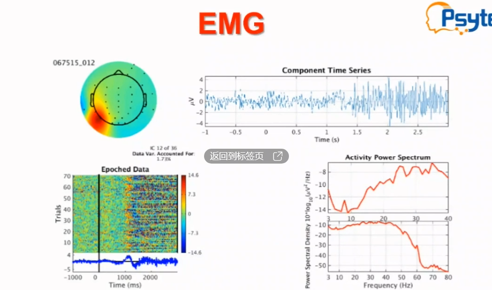

5. 正常
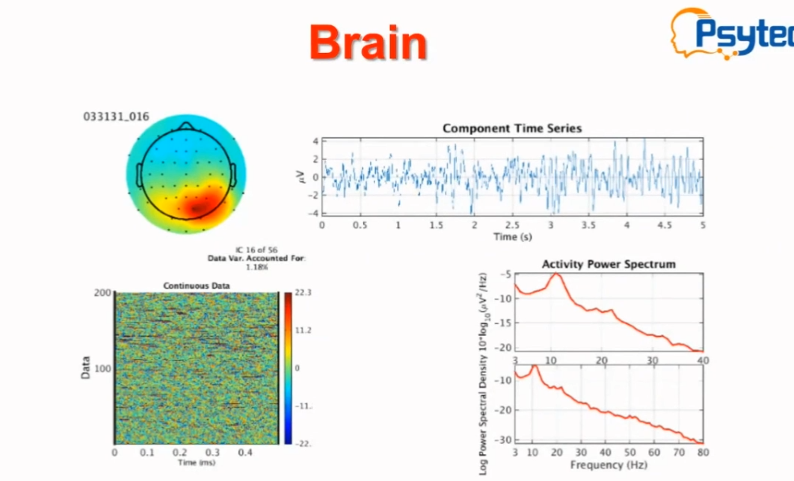

6. 市电干扰
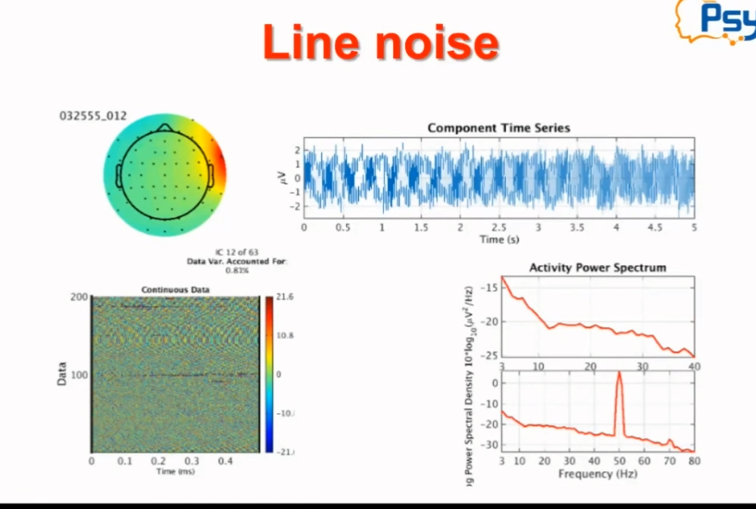

7. 夹杂市电干扰
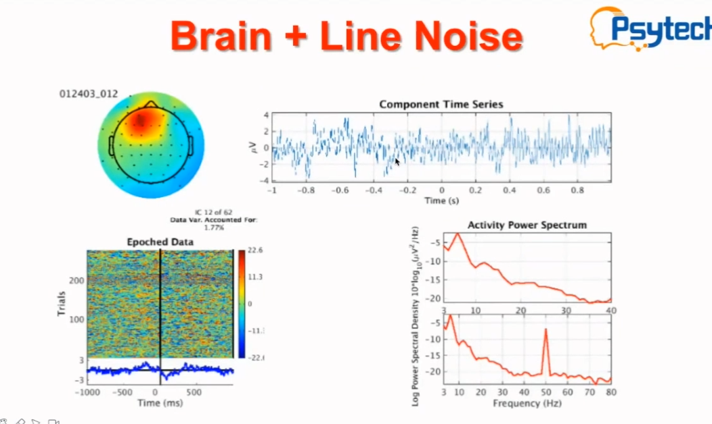

