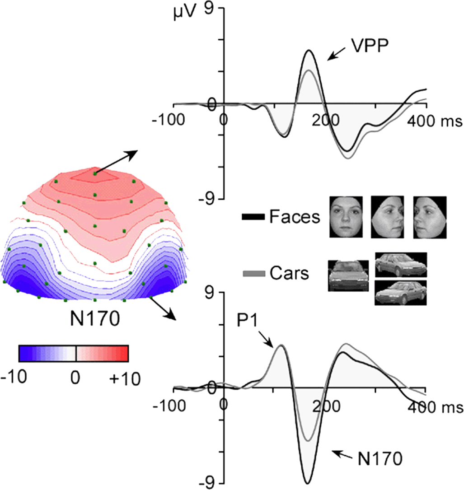

## N170成分
本次以ERP中的N170成分为例展示ERP成分分析过程, N170是发生在刺激呈现后，130-200ms时间窗口的一个负成分。当将**面部图片**引发的erp与其它视觉刺激引发的erp进行比较时，在该时间窗口处，前者会有一个更大的差异负波。**这一差异在颞枕区域的电极点会达到最大值**。这与颅内脑电的发现是很接近的，即发生在颞叶下部和梭状回。N170最先在1996年发现。面部，或者面部的部分属性（比如眼睛），会引发相对于其它刺激（动物面部，身体，骑车）的差异波。

然而，尽管N170是面部加工的一个典型指标，但对于具体的面部却不敏感。有研究发现，通过250-500ms处的脑电活动(N250)可以预测被试看的究竟是哪一张面部图片。这表明，N170可能只是一个抽象水平的面部加工指标，“我看到了一张脸”。更精细的加工发生在250ms之后，“我看到了小明的脸”。由面部刺激引发的N170，往往具有右偏侧化的倾向，而由词汇刺激引发的N170，往往具有左侧偏侧化的倾向。但是最近也有研究发现，词汇N170也发生在右侧。

