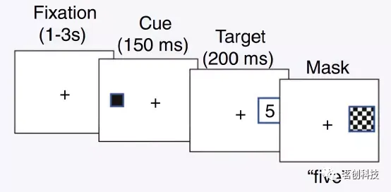
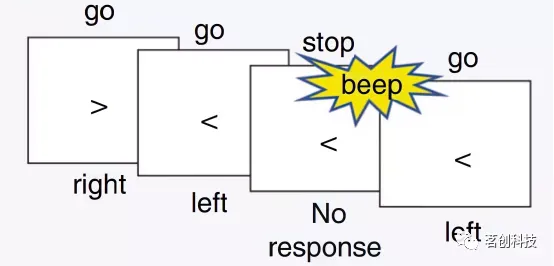
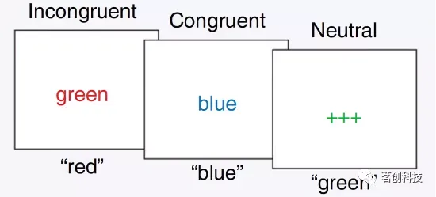
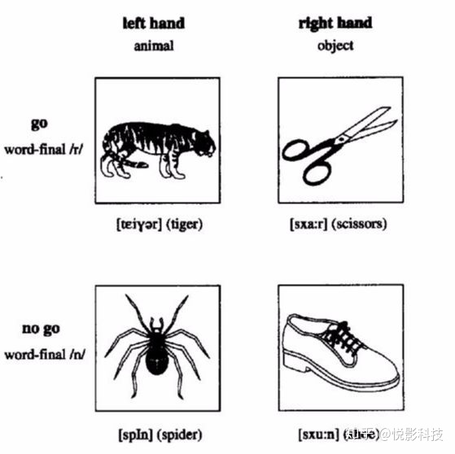
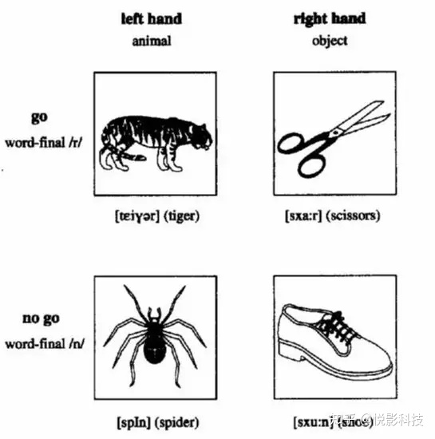
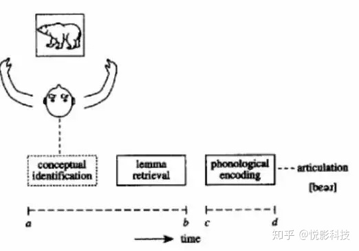
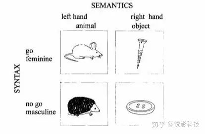

实验范式(Experimental Paradigm)：是指在各种心理过程和各个心理学分支的研究中较经典的实验任务。也就是相对固定的实验程序。认知科学和实验心理学家陈霖院士指出：**心理学实验范式是认知科学的三大基础之一，另两大基础是心理学变量和脑成像技术**。

## 认知控制和执行功能研究实验范式
节选自 https://zhuanlan.zhihu.com/p/413920863

实验范式(Experimental Paradigm)：是指在各种心理过程和各个心理学分支的研究中较经典的实验任务。也就是相对固定的实验程序。认知科学和实验心理学家**陈霖院士**指出：**心理学实验范式是认知科学的三大基础之一，另两大基础是心理学变量和脑成像技术**。以下展示了认知控制和执行功能研究中一些常用的实验范式。

### 反应抑制和干扰控制任务
#### Antisaccade（反向眼跳任务）

实验中要求被试抑制对外围目标的注视，并注视与它相反的位置。

#### Stop-signal（停止信号任务）
要求被试看到屏幕上出现刺激 (如“>”或“<”)时，就分别按右键和左键。如果听到作为停止信号的声音“哔”，就停止按任何一个键。

#### Stroop（斯特鲁普范式）
实验者给被试呈现用不同颜色写成的单词，要求被试尽快且正确地地说出每个词的颜色，而不理会这个词的名称及其所代表的意义。

## 事件相关电位(ERP)研究的经典实验范式 
整理自 https://www.sohu.com/a/526728061_121124571
ERP技术是理解心理及其相应的脑活动的一个十分便利的工具。本文对文献中**使用ERP技术的常用实验范式如Go/Nogo范式，Oddball范式，Flanker范式，Stroop范式等进行介绍、举例、分析和总结，以厘清它们之间的异同，避免在研究中的误用或错用。**

### 引言
ERP的发展经历了一个较长的阶段。在1929年，汉斯·伯格证明将电极放在人的头皮上，可以测量人的脑电活动，通过技术的处理，可以放大这个信号，以及观测其具体的变化。这就是脑电图(EEG)。随后，经历了几位科学家的努力，最终才使人们相信，这种信号并不是伪迹，而是真正存在的人脑的神经电活动。随后的几十年里，科学家的研究不断证明，EEG无论是在科学领域还是在临床上都非常有用，但是也发现了一些不足，比如对EEG的测量只是对大脑神经电活动的一种粗糙的整体性的测量，而很难观测到某一个具体的认知过程是什么样的。后来，研究者使用简单平均的技术，把某些认知和运动事件相关的神经反应提取出来，于1939年发表了清醒的人类感觉ERP记录，这就是事件相关电位的获得。

现代的ERP研究开始于1964年，沃尔特发现了“关联性负变化”，这是人类发现的第一个认知性的ERP成分。他**在实验中，先给被试一个警告的信号，然后再呈现靶刺激，让被试对靶刺激做按键反应，这时，在警告信号和靶刺激之间的一小段空暇时间里，能够观察到额部的一个巨大的负电压，这显然是被试对即将出现的靶刺激的一种准备，它就是<u>关联性负变化(CNV)</u>**。在同期，研究者们还有另外一个重要的发现，即发现了**P300成分**，它的峰值在刺激后的300ms左右，主要发生在被试**不能预测**下一个刺激是视觉刺激还是听觉刺激时。当他能预测时，那么这个成分就会大大的减小。此后研究者们对于P300以及其他的ERP成分的识别、实验中ERP信息的记录与分析上进行了大量的研究，这大大加深了人们对于ERP的认识，为以后探索那些有科学意义的认知问题提供了强有力的技术手段。

后来，随着时间的推移，具有广泛科学意义的研究逐步增加，这使得ERP技术的声望不断提高，并且与PET和fMRI一道，为认知神经科学的研究做出了重要的贡献。

总而言之，人们对于ERP的特性和成分的认识正在逐渐加深，应用ERP技术对认知过程进行探讨的研究层出不穷。ERP技术具有显著的优点。首先，ERP能够测量从刺激呈现之前到个体做出反应之后的连续时间段里脑电的变化情况，这就能够精确的判断受到实验操作影响的是哪个认知过程。而行为实验的反应时和正确率测量则无法确定究竟是哪个认知过程的变化而导致反应时或正确率变化。**比如，在经典stroop任务中，使用ERP技术能精确的确定词色不一致的冲突条件下，到底是因为知觉过程的变慢，还是反应过程受到影响**。其次，ERP能够在没有行为反应的情况之下，提供一种关于刺激处理的实时测量。比如，在Go/Nogo实验范式中，我们可以对注意刺激和忽略刺激的反应进行比较，这时使用ERP对脑电进行记录，就很可能对不要求反应的忽略刺激进行内隐的监测，这种实时信息处理的内隐监测能力是ERP的最大的优点。除此之外，ERP还具有无创伤性，时间分辨率高，费用不太昂贵等等优点，这些优点让ERP技术能够经久不衰，在认知神经科学的研究中能够持续的发光发热。

尽管有行为研究和其他技术无法比拟的优势，ERP技术仍然免不了许多局限。首先，**最明显的缺点是，ERP成分的功能和意义实际上远没有行为反应的功能和意义这样清楚**。比如，两种条件下反应时差异为120ms，那么这个120ms的含义是比较清楚的，即二者在信息的编码，处理和做出反应的时间差距。但是如果两个ERP成分的潜伏期存在一定差异时，如果没有精确的假设和推理，就基本上得不到结论，因而相较于其他的测量手段，ERP测量所得到的结果是更难解释的。其次，由于ERP比较小，所以必须通过大量的实验试次来弥补。ERP实验中，通常都需要在每种条件每个被试下进行50，100甚至更多的试次才能获得比较好的结果，这就带来了很大的限制。除此之外，ERP的空间辨别力较差，空间定位基本上是不准确的，且无法估计ERP定位的误差，除非在特殊的条件之下。

使用ERP技术，就必须使用合适的实验范式。何谓“合适”，或许也不见得有十分准确的划定范围。但是，从文献和相关著作中进行总结概括，就能发现将常被使用到的有Go/Nogo实验范式，Stroop范式，Oddball范式和Flanker范式及其相关的变式。下面对各种实验范式和变式进行介绍，并举例说明。

### 相关实验范式
####  Go/Nogo实验范式
Go/Nogo联想测验是由诺塞克和巴纳吉(2001)为了弥补内隐联想测验(IAT)的不足而提出的实验范式，它保留了经典IAT中的两个关键任务，同时又采用信号检测论中的辨别力指数为指标。

**该范式要求被试对一些刺激做出反应而忽略另外的一个刺激**。例如，要测量被试对狗熊的态度，那么就呈现狗熊、褒义词和贬义词三类刺激，然后将“狗熊+褒义词”和“狗熊+贬义词”作结合，制作成实验材料，让被试对“狗熊+褒义词”组合而忽略“狗熊+贬义词”，在接下来的实验中，让被试做相反的反应，然后记录反应时，正确率等指标，利用信号检测论的方法进行数据分析。

对于Go/Nogo范式来说，它可以结合ERP技术来测量被试的抑制控制能力，让被试根据实验的目的，抑制不必要的优势反应或者习惯化反应，即反应抑制。研究发现，与测验反应抑制相关的ERP成分是N200。N200反映了冲突监控及抑制的过程与强度，在非冲突的条件下(即Go反应)，N200的波幅比冲突条件下(No go反应)要更小。

#### Flanker范式

该实验范式又称侧抑制任务，是由艾瑞克森(Eriksen)(1974)等人在探究干扰字母对目标字母识别的影响中最先使用的研究范式。**当被试判断屏幕中居中的目标刺激时，如果目标刺激两侧的干扰刺激与目标刺激相反，那么对于目标刺激的反应就要慢于目标刺激和干扰刺激相同的情况下，正确率也要更低。**

Flanker范式同样可以结合ERP技术来测量被试的干扰抑制控制。

在近期的一项研究中(陈晨等，2020)，研究者使用Go/Nogo范式、Flanker范式分别研究反应抑制活动和干扰抑制活动的心理和神经电生理机制。在实验中，Go/Nogo范式首先呈现注视点1.5s，随后是刺激图片呈现1.5s，要求被试对刺激X不作反应，而对其他的字母刺激做出反应，一共进行150次，同时记录脑电信号。在Flanker范式中，首先给被试呈现注视点1.5s，然后呈现刺激图片1.5s，要求被试判断刺激图片中央箭头的方向，箭头向左就点左键，向右点右键。

实验的结果发现，在冲突条件下，被试的错误率比非冲突条件下更高，且诱发了更大的N200波幅。其中Go/Nogo范式诱发的波幅比Flanker波幅更大，潜伏期更长，二者都激活了额区。这些研究结果表明，反应抑制和干扰抑制都有效的反映了抑制控制过程，且两种抑制控制诱发的N200主要位于额区。额区是与计划、执行等高级认知功能相关联，这是使活动服从于目的、动机和意图，对生存有重要意义。与此同时，两种抑制过程也存在差异，即反应抑制的脑电激活强度高于干扰抑制，这说明反应抑制更加困难，需要消耗更多的认知资源。研究还发现，干扰抑制主要涉及早期的认知加工阶段，反应抑制主要涉及后期加工阶段对运动反应的调整和抑制。研究揭示了两种实验范式的异同，这对于未来进行相关研究提供了一些有益的指导。

#### Stroop范式
**经典Stroop范式是呈现不同颜色书写的单词，要求被试报告单词的颜色，而忽略词义。当词的颜色和意义一致时，被试报告的速度最快，而当单词颜色和词义不一致时，报告的速度就很慢**。后来马塞尔对之进行改进，形成了Stroop启动实验，即先呈现一个启动词(如红)，然后呈现一个色块(如绿色色块)，要求被试报告色块的颜色。如果这种启动效应存在，那么在启动词和色块颜色一致的情况下，被试报告的速度要比不一致条件下快。更进一步的，采用掩蔽技术对启动词进行掩蔽，从而研究不同的知觉条件下，启动效应是否都存在。如果知觉可以在无意识条件下存在，那么掩蔽就不能消除启动效应。

研究者(陈琼等，2020)使用Stroop范式，结合ERP技术考察了听障儿童的认知抑制控制的行为特点和脑内时程特点。与Stroop冲突效应相关的脑电成分是N450和SP。**其中N450是在认知抑制控制过程中监测冲突的，持续电位SP在认知抑制控制过程中主要起到冲突解决和冲突适应的作用，但是这一成分有个明显的缺陷，即存在不稳定性**。该研究在情绪图片库中选择了10张男性10张女性的中性情绪面孔图，图片上写男或者女，要求被试判断图片的性别，而忽略上边的字。这里，面孔与字的含义相同为非冲突条件，不同则为冲突条件。在实验过程中，首先呈现注视点500ms，然后是空屏，紧接着是刺激图片呈现1000ms，随后又有一个空白，进入下一个试次。结果发现一致条件下反应快于不一致条件，且在不一致条件下，N450和SP的激活程度都比较高。对于听障儿童来说，枕区N450负激活程度显著高于正常儿童，任务完成正确率也显著的低。这些结果说明，在不一致的条件下，个体都需要投入更多的认知资源，听障儿童尽管投入了较多的努力，但是任务正确率依然很低，表明他们在认知抑制控制的过程中，监测冲突的信息和抑制无关信息的认知资源都是十分有限的，而冲突解决机制可能是没有问题的，SP在冲突条件下的显著正激活表明Stroop任务中出现了冲突解决效应，但是这里需要慎重下结论，因为无法排除SP的不稳定性。

#### Oddball范式

Oddball范式是指采用两种或以上的视觉或者听觉刺激进行持续的交替呈现，且不同刺激呈现频率相差较大，根据刺激频率的差异来研究被试的脑活动。它有较多种操作模式，如，有两种刺激，标准刺激的呈现概率为70%，偏差刺激为30%，要求被试对偏差刺激做反应;或者在这些刺激中插入缺失刺激，要求被试对缺失刺激做出反应等。它可以引发ERP的P300等成分。

近些年使用较多的是双选择Oddball范式，这是经典范式的修订版，即**要求被试对大概率的标准刺激和小概率的偏差刺激做出两类不同的按键反应。由于标准刺激的频率较大，因而被试对标准刺激的反应就成为优势反应。当偏差刺激出现时，被试需要抑制优势反应，而确保对偏差刺激做出正确的反应**。

研究者采用双选择Oddball范式对负性情绪干扰行为抑制控制进行研究(辛勇、李红、袁加锦，2010)。选用的标准刺激是一张凳子的自然景物图，而偏差刺激是不同效价的情绪图片，首先呈现注视点300ms，然后是一个随机空屏，紧接着是刺激图片。被试对标准刺激和偏差刺激进行不同的反应。结果发现，负性条件下的反应时显著长于中性和正性，偏差刺激引起的显著行为抑制效应，集中表现为P300的活动偏差。除此之外，负性条件下N200的潜伏期也显著的更长。这些结果表明，负性条件下，人脑抑制加工会增强，导致反应时增加。由于N200是冲突监控中注意分配的直接指标，其潜伏期代表反应冲突觉察的速度，所以在负性条件下，被试消耗了更多的认知资源，且觉察反应冲突的速度也比较慢。人类对负性情绪事件存在加工偏向，容易导致任务相关维度加工的不足，所以个体需要克服对情绪维度的加工偏向，从而有效的监控反应冲突并完成行为抑制控制。

### 总 结

ERP技术经过了较长的时间才发展的比较完备，尽管仍存在很多缺陷，但是在认知神经科学的研究中仍然有不可替代的地位。在使用ERP技术研究认知机制的文献中，远远不止上述这4种实验范式被使用，还有更多的实验范式可以选用，但是这几种是十分经典又广泛运用的。因而在本文中对之进行了回顾，梳理和举例，以求加深对其的优缺点和适用性的理解，便于在未来的研究中，能够选用最合理的实验范式，得到最科学的结果。

## ERP经典范式知多少—重温Go/Nogo范式的经典实验
ERP（Event-related Potentials）作为神经电生理研究中的重要方法已经被广泛的应用在脑科学研究中。在ERP研究中，实验范式是重中之重，可靠的实验范式能够帮助研究者更好的达到实验目的，并且**一些特殊的实验范式还可以诱发特定的ERP成分来帮助研究者达成特定的实验需求**。因此，在ERP研究的历史中，一些设计精巧并且在可重复性上表现稳定的实验范式成功的脱颖而出，成为了受到众多研究者青睐的经典范式。如oddball范式、掩蔽范式、启动范式、双任务范式、干扰范式等等。而今天我们要介绍的范式是在语言研究中对词汇产出的时间序列模型产生重大影响的Go/No go 范式。接下里就让我们通过对两篇经典文献的回顾来看看Go/No go 范式的实现以及其经典之处！

### 什么是GO-Nogo实验范式
Go/Nogo范式其实是双任务范式的一种变化，被试需要在接受到刺激后通过两个不同的线索来决定是否要作出反应，那为什么说它是双任务的一种变化而不是双任务范式呢？这是因为双任务范式往往需要诱发两个任务上的冲突，任务的进行存在时间进程上的重叠，而Go/Nogo 范式中被试对两个任务的反应是由时间上的延续性的，即被试执行完一个任务再执行另一个任务，两个任务不存在时间上的重叠。

在这张图中体现了两个任务，被试需要在看到图片时需要依据单词结尾的字母是“R”还是“N”来决定是否要进行按键，即单词结尾的字母是“R”就按键，单词结尾的字母是“N”就不按键。除此以外，被试还需要根据看到的图片内容是“动物”还是“物体”来决定用哪只手来进行按键，即看到的图片内容是“动物”用左手按键，看到的图片内容是“动物”用右手按键。也就是说被试在看到图片后，要做两个任务，一个是用哪个手按键，一个是要不要按键。决定的顺序由被试自己决定，即他的自然反应来决定.

### Go-Nogo引发的ERP成分
在Go/Nogo 范式中，研究者主要关注的ERP成分是LRP（偏侧预备电位）和N200成分。先来看看LRP，LRP是一定时间内监测到的对刺激做出反应的脑电类型。LRP被认为反映了反应手运动准备偏侧化的平均量，在反应手对侧运动皮质观测到的波幅更大。它是反应手预备动作在大脑皮质的直接反映；甚至在准备动作还未进行的情况下也能产生。这就说明它能够反应被试在Go/No go 范式中作出的运动准备，即被试可能已经决定好用哪个手进行反应但发现该图片不需要进行反应就会诱发出一个运动准备，这时你就可以在这个trial的时间窗内发现LRP的出现，是不是很精巧！！！

再来看看N200。刺激出现100-300ms后呈现的抑制性负波为N200，反映了Nogo条件下的抑制。通过变化信息的特点和测量N200的时间性，可研究语义、语音、句法信息加工相对顺序；比LRP更稳定。N200成分是被试在执行Nogo 刺激后诱发出的反应认知行为的脑电成分。N200波峰在时间上的先后可以反应特定任务在时间上的先后顺序。

#### 语义和语音加工原来是分开的？

且看Go/No go如何探测词汇产出中语义和语音的加工时间。

Van Turennout et al., （1997） 的实验通过Go/No go范式成功的分离了词汇产出过程中语义和语音在时间上的先后顺序。我们在介绍Go/No go范式时使用的图片就来自这个实验。接下来让我们看看研究者是如何将紧密结合的语音和语义在时间顺序分离开的吧。

没错，还是这张图。我们先来回忆一下实验任务，被试需要在看到图片时需要依据单词结尾的字母是“R”还是“N”来决定是否要进行按键，即单词结尾的字母是“R”就按键，单词结尾的字母是“N”就不按键。除此以外，被试还需要根据看到的图片内容是“动物”还是“物体”来决定用哪只手来进行按键，即看到的图片内容是“动物”用左手按键，看到的图片内容是“动物”用右手按键。也就是说被试在看到图片后，要做两个任务，一个是用哪个手按键，一个是要不要按键。那么怎么实现对语义和语音的分离呢？

作者假设语义加工先于语音编码，对图片语义信息的提取会先于语音信息。因此，在图一中，被试在a-b阶段会完成左/右手的按键准备，然后在c-d阶段，被试会完成对词汇形式的加工并完成语音编码，执行go/no-go任务。这样，选择正确的按键手的准备在a-b阶段就已经开始，是否需要按键则只会在c-d阶段完成。因此，作者预测在两个阶段都会产生LRP，但是在no-go任务中，LRP的波幅会逐渐降低并最后消失（因为他不需要按键了，只是完成了要用哪只手进行按键的准备）。

这就是实验一得到的结果了，我们可以看到实验结果完全符合研究者的预期。go与no-go反应中都能获得明显的预备偏侧电位，二者在阴影部分的时间间隔窗后开始体现出与基线相比明显不同的变化趋势。LRP的变化反映出被试在语音加工执行前已经通过语义加工来确定反应手，在语音加工完成后，LRP在go trail里体现出了与no-go trail里完全不同的增长速度。在go反应中，LRP开始持续升高并在按键反应执行后开始下降，在no-go反应中，LRP在语音编码完成后就开始下降并最终回到基线上。

英明的教授都会告诉你，“大胆假设但必须小心求证”，该研究者以假设中的顺序设定任务有没有影响到实验结果呢？为了回答这个问题，作者又做了第二个实验。被试被要求通过语音判断来决定用哪只手反应，在一个block里以“R”音素结尾的用右手按键，以“N”结尾的用左手按键。被试需要通过判断图片的语义信息来决定是否按键，看到图片是动物时按键，看到图片是物体时不按键。也就说和之前的任务反过来，从无假设的角度来再做一遍实验。实验结果是什么呢？

从LRP的波幅来看，实验二中no-go trail 中没有明显的预备偏侧电位出现，而go trail中则出现了明显的预备偏侧电位，这说明被试在做出哪只手进行按键反应之前已经完成了要不要按键这一加工过程，这也解释为什么No-go trail 没有出现LRP，因为被试已经决定不需要按键了，就不会有动作准备，那用哪只手进行反应的选择自动失去了意义。在这个实验中语义部分是负责要不要执行按键的，因此说明了语义加工是先于语音编码的，这与实验一中得出的结论相同。

到此，作者证明了我们在词汇产出中语义的加工是先于语音的，也就是说我们在选定了词义后再进行语音形式的编码，这两者并不是同时进行的。只是这种加工在毫秒级别就完成了，所以平时说话时我们就很难自然感知了。

#### 语义和语音加工原来是分开的？

且看Go/No go如何探测词汇产出中语义和句法的加工时间。

语音和语义分开加工我能理解，但句法为什么也是分开的呢？接下来我们来看看Bernadette M. Schmitt et al., （2001 ）是如何证明句法（小编认为实验里的任务称为词法更为合适，但作者文章里使用了“SYNTAX”一词，忠于原文）和语义在加工时间上的分离的。先上图！

实验仍旧分为两个实验，第一个实验中，被试通过语义信息控制反应手，如果图片是动物，就用左手按键；如果图片是物体，就用右手按键。通过语法信息控制是否按键，如果图片是阴性的，执行按键；如果图片是阳性的，则不执行按键。第二个实验则交换条件，即通过语法信息控制反应手，是左手还是右手，通过语义信息控制是否按键，即go还是nogo。

从实验结果图来看，语义控制go/no-go任务与语法控制go/no-go任务时相比，语义控制时，go任务与no-go任务中N200的波幅差值（no-go 减去 go）的波峰比语法控制时go任务与no-go任务中N200的波幅差值的波峰在时间上更早的达到峰值。这说明被试在决定不按键时，语义控制的不按键产生的N200成分要比语法控制的不按键产生的N200成分在时间上来的更早。从而说明了语义加工时先于语法的。